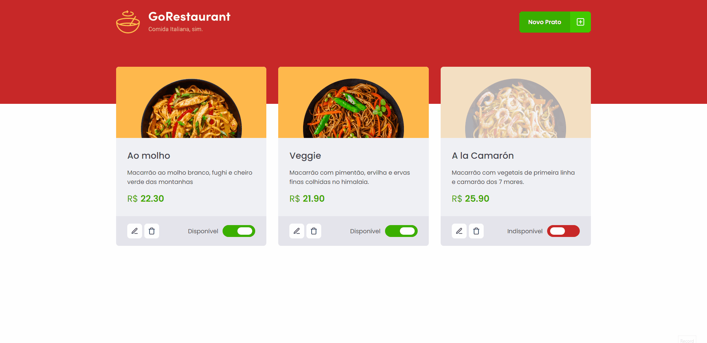
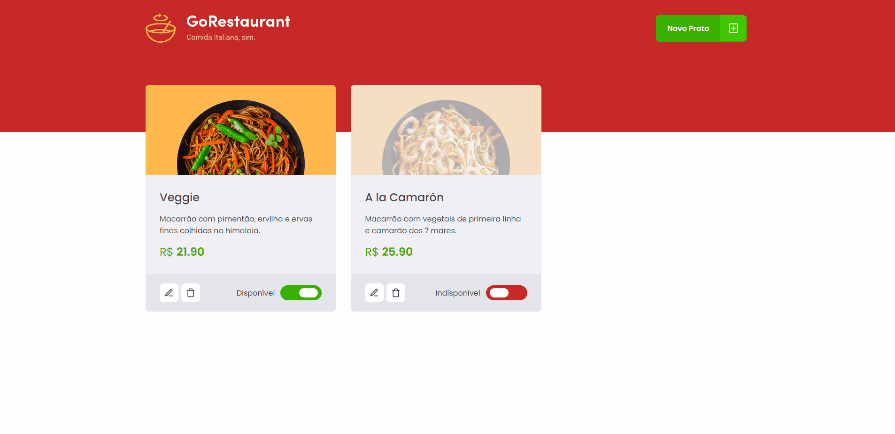

<p align="center">
  
</p>

<p align="center">
 <a href="#gorestaurant">Sobre</a> •
 <a href="#%EF%B8%8Ffuncionalidades">Funcionalidades</a> •
 <a href="#-layout">Layout</a> •
 <a href="#-como-executar-o-projeto">Como executar o projeto</a>  •
 <a href="#-tecnologias">Tecnologias</a>
</p>

# GoRestaurant

<div style="display: flex; gap: 8px">
  
  
</div>

Aplicação já funcional onde o principal objetivo é realizar dois processos de migração: <br />

- de Javascript para Typescript;
- de Class Components para Function Components.

<h4 align="center"> 🚧 GoRestaurant 🚀 em construção 🚧 </h4>

## ⚙️Funcionalidades

- [x] TypeScript
- [x] Migração de:
  - [x] src/components/Food/index.jsx;
  - [x] src/components/Food/styles.js;
  - [x] src/components/Header/index.jsx;
  - [x] src/components/Header/styles.js;
  - [x] src/components/Input/index.jsx;
  - [x] src/components/Input/styles.js;
  - [x] src/components/Modal/index.jsx;
  - [x] src/components/ModalAddFood/index.jsx;
  - [x] src/components/ModalAddFood/styles.js;
  - [x] src/components/ModalEditFood/index.jsx;
  - [x] src/components/ModalEditFood/styles.js;
  - [x] src/pages/Dashboard/index.jsx;
  - [x] src/pages/Dashboard/styles.js;
  - [x] src/routes/index.jsx;
  - [x] src/services/api.js;
  - [x] src/styles/global.js;
  - [x] src/App.js;
  - [x] src/index.js.

## 🎨 Layout

<!-- <p align="center" style="display: flex; align-items: flex-start; justify-content: center; gap: 8px ">
  
  
</p> -->

<a href="#">
  
</a>

## 🚀 Como executar o projeto

### Pré-requisitos

Antes de começar, você vai precisar ter instalado em sua máquina as seguintes ferramentas:

- [Git](https://git-scm.com) e [Node.js](https://nodejs.org/en/);
- Além disto é bom ter um editor para trabalhar com o código, como o [VSCode](https://code.visualstudio.com/).

Após tudo configurado e instalado

```bash
  # Clone este repositório
  git clone https://github.com/vitormarco/gorestaurant-js-class-to-ts-func.git
```

```bash
  # Acesse a pasta pelo terminal/cmd
  cd spacetraveling
```

```bash
  # execute comando para instalar as dependências
  yarn

  # ou

  npm install
```

```bash
  # execute o script para inicial o projeto

  yarn dev

  # ou

  npm run dev
```

## 🛠 Tecnologias

As seguintes ferramentas foram usadas na construção do projeto:

- ✔️ [ReactJS](https://reactjs.org/)
- ✔️ [Typescript](https://www.typescriptlang.org/)
- ✔️ [Unform](https://github.com/unform/unform)
- ✔️ [Axios](https://github.com/axios/axios)
- ✔️ [Styled Components](https://styled-components.com/)
- > Veja o arquivo [package.json](https://github.com/vitormarco/class-component-to-function-component-ts/blob/master/package.json)

Feito com 🧡 por Vítor Marco 👋🏽 [Entre em contato!](https://www.linkedin.com/in/vitor-marco/)
